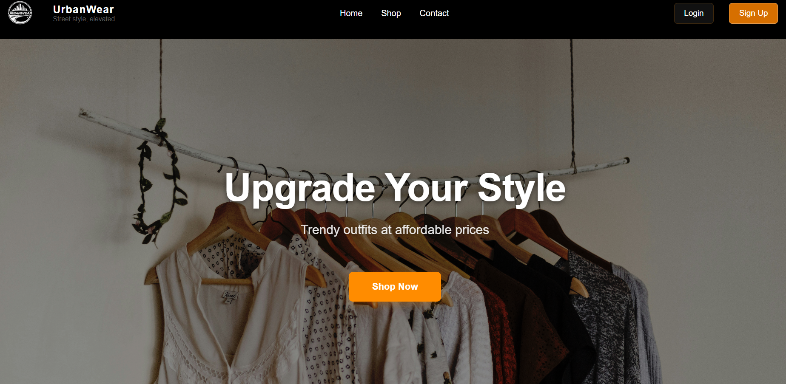
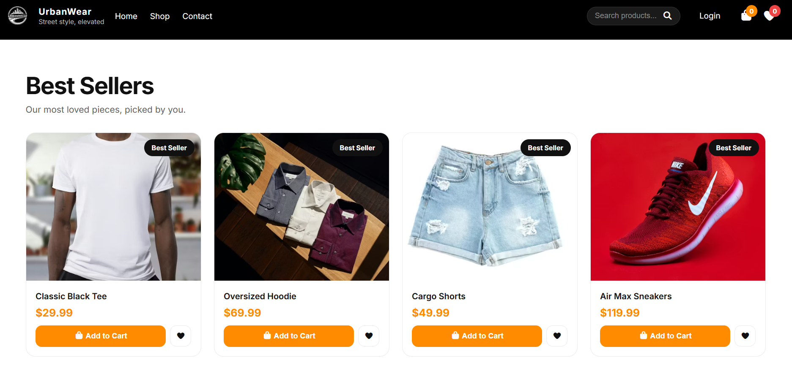

git add .# UrbanWear Website

A modern, responsive e-commerce website for UrbanWear, a street style clothing brand offering trendy outfits at affordable prices.

## Project Overview

UrbanWear is a fully responsive web application built with HTML, CSS, and JavaScript. The site features a clean, contemporary design with a dual-logo branding system and Firebase Email/Password Authentication.

**Brand Tagline:** _Street style, elevated_

## Preview




## Future Enhancements

- Expand product/backend integrations
- Add more account features on top of Firebase Authentication
- Add cart + checkout flow
- Connect to a real product database

## Project Structure

```
UrbanWear Website/
├── index.html                    # Homepage
├── Assets/
│   ├── fonts/                    # Custom fonts
│   ├── icons/                    # SVG and icon files
│   └── images/
│       └── Logos/                # Brand logos
├── Pages/
│   ├── contact.html              # Contact page
│   ├── dashboard.html            # User dashboard
│   ├── favorites.html            # User favorites
│   ├── login.html                # Login page
│   ├── password-reset.html       # Password recovery
│   ├── privacy.html              # Privacy policy
│   ├── shop.html                 # Product shop
│   ├── signup.html               # Registration page
│   └── terms.html                # Terms of service
├── scripts/
│   └── pages/
│       ├── login.js              # Login functionality
│       ├── logo-switcher.js      # Dynamic logo switching
│       ├── shop.js               # Shop page logic
│       └── signup.js             # Signup functionality
├── styles/
│   ├── general.css               # Global styles
│   ├── landing.css               # Homepage styles
│   ├── layout.css                # Layout and grid systems
│   └── pages/
│       ├── contact.css           # Contact page styles
│       ├── dashboard.css         # Dashboard styles
│       ├── login.css             # Login page styles
│       ├── password-reset.css    # Password reset styles
│       ├── privacy.css           # Privacy policy styles
│       ├── shop.css              # Shop page styles
│       ├── signup.css            # Signup page styles
│       └── terms.css             # Terms page styles
├── Tools/
│   └── LOGO_SYSTEM_GUIDE.md      # Logo implementation documentation
└── README.md                      # This file
```

## Pages

### Public Pages

- **Homepage** (`index.html`) - Landing page with featured products and hero section
- **Shop** (`Pages/shop.html`) - Product catalog and shopping interface
- **Contact** (`Pages/contact.html`) - Customer contact form
- **Privacy** (`Pages/privacy.html`) - Privacy policy information
- **Terms** (`Pages/terms.html`) - Terms of service

### Authentication Pages

- **Login** (`Pages/login.html`) - User login interface
- **Sign Up** (`Pages/signup.html`) - New user registration
- **Password Reset** (`Pages/password-reset.html`) - Password recovery

### Protected Pages

- **Dashboard** (`Pages/dashboard.html`) - User account dashboard
- **Favorites** (`Pages/favorites.html`) - Saved favorite items

## Branding System

UrbanWear implements a dual-logo system to optimize visual hierarchy:

- **Detailed Logo** - Used on the homepage for strong brand impact
- **Text Logo** - Used on secondary pages for a cleaner, more minimalist appearance

See [LOGO_SYSTEM_GUIDE.md](Tools/LOGO_SYSTEM_GUIDE.md) for detailed logo specifications and implementation details.

## Getting Started

### Prerequisites

- A modern web browser (Chrome, Firefox, Safari, Edge)
- A Firebase project with Email/Password sign-in enabled
- A local file server for ES modules

### Running Locally

1. **Clone or download** the project to your local machine
2. **Add your Firebase values** in `scripts/firebase/env.js`
3. **Serve the folder** with a local web server
4. **Visit** `http://localhost:8000` in your browser

### File Server

Firebase ES modules need the site to be served through a local web server:

```bash
# Using Python 3
python -m http.server 8000

# Using Node.js (with http-server package)
npx http-server

# Using PHP
php -S localhost:8000
```

Then visit `http://localhost:8000` in your browser.

## Firebase Authentication Setup

1. Create a Firebase project at <https://console.firebase.google.com/>.
2. Open **Authentication > Sign-in method** and enable **Email/Password**.
3. Open **Project settings > General > Your apps** and create or select a Web app.
4. Copy the Firebase config values.
5. Replace the placeholder values in `scripts/firebase/env.js`.

Example:

```js
window.__URBANWEAR_FIREBASE_CONFIG__ = {
  apiKey: "your-api-key",
  authDomain: "your-project.firebaseapp.com",
  projectId: "your-project",
  storageBucket: "your-project.appspot.com",
  messagingSenderId: "123456789",
  appId: "1:123456789:web:abcdef"
};
```

`scripts/firebase/env.js` is listed in `.gitignore`, and `scripts/firebase/env.example.js` is the template to copy from. Firebase Web API keys are not admin secrets, but keeping config out of page logic makes the app easier to maintain.

## Auth File Structure

- `scripts/firebase/firebase-config.js` initializes Firebase Auth and keeps persistence enabled.
- `scripts/auth/auth-service.js` contains signup, login, logout, auth-state watching, and friendly Firebase error messages.
- `scripts/auth/form-utils.js` handles validation feedback, button loading states, and the success overlay.
- `scripts/auth/auth-state.js` updates navbar account/logout UI after refreshes.
- `scripts/pages/login.js`, `scripts/pages/signup.js`, and `scripts/pages/dashboard.js` connect the shared auth layer to each page.
- `styles/auth.css` adds only the shared auth feedback/loading/navbar styles.

## Technologies Used

- **HTML5** - Semantic markup and structure
- **CSS3** - Responsive styling and layout
- **JavaScript (ES6)** - Interactivity and dynamic features
- **Firebase Authentication** - Email/password signup, login, logout, and persisted sessions
- **Responsive Design** - Mobile-first approach

## Key Features Explained

### Logo Switcher

The `logo-switcher.js` script dynamically switches between the detailed and text logos based on the current page context. This ensures optimal visual presentation throughout the site.

### Responsive Layout

The website uses a mobile-first responsive design approach with breakpoints for:

- Mobile devices (320px and up)
- Tablets (768px and up)
- Desktop displays (1024px and up)

### Navigation

- **Main Navigation** - Consistent navbar across all pages
- **Call-to-Action Buttons** - Login and Sign Up buttons in header
- **Footer Navigation** - Links to legal pages and contact

## Styling Architecture

- **general.css** - Base styles, typography, and common components
- **layout.css** - Grid system, flexbox layouts, and spacing utilities
- **landing.css** - Homepage-specific styling
- **Page-specific CSS** - Individual styles for each page in `styles/pages/`

## Future Enhancements

- Backend API integration for product catalog
- Account profile and order history features
- Shopping cart and checkout process
- Product filtering and search
- User review and ratings system
- Wishlist functionality
- Email notifications

## Browser Support

- Chrome (latest)
- Firefox (latest)
- Safari (latest)
- Edge (latest)

## License

© 2026 UrbanWear. All rights reserved.

## Contact & Support

For support or inquiries, please visit the [Contact Page](Pages/contact.html).

---

## Contributing

Pull requests are welcome. For major changes, please open an issue first.

## Author

Dennis Infinity  
Frontend Developer (HTML, CSS, JavaScript)

**Last Updated:** April 2026
